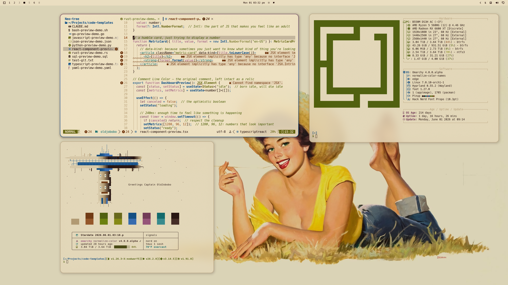
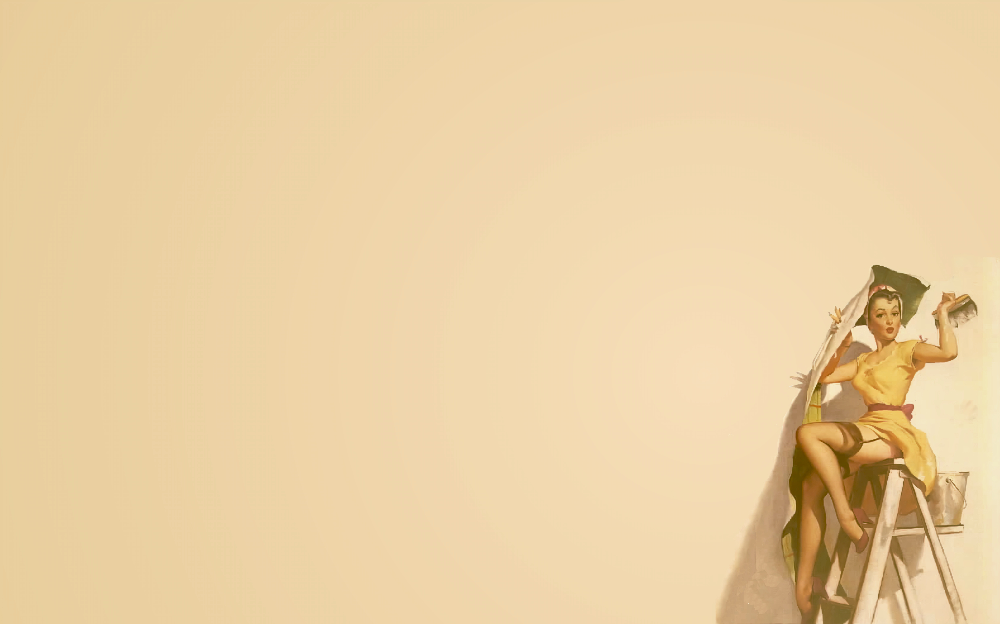
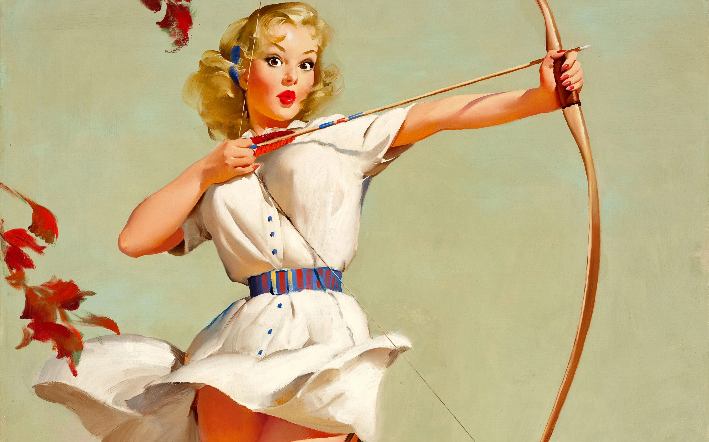
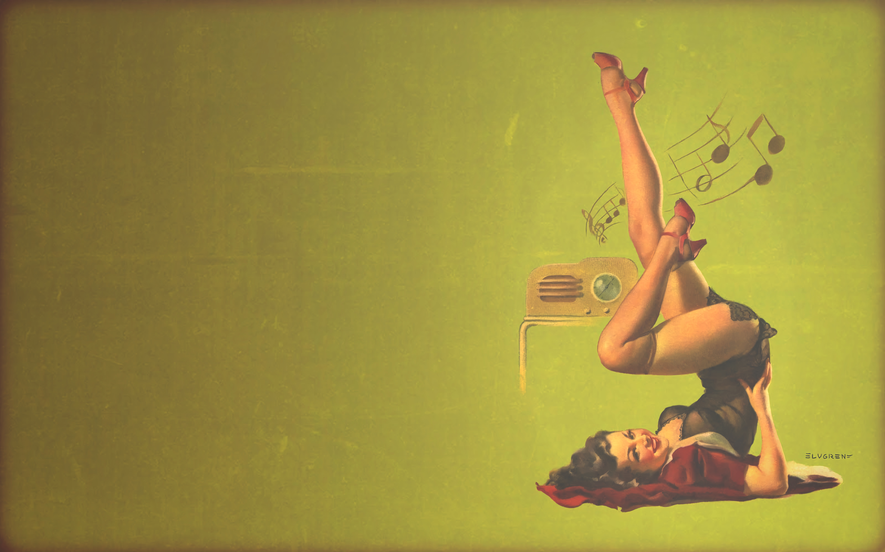

# Omarchy Pinup Theme

A light vintage pin-up theme for Omarchy, built around warm paper, dark ink, sailor blue focus states, burgundy accents, and soft rounded surfaces. It keeps the desktop bright and readable while giving the shell, terminals, editor themes, and notification surfaces the same printed-poster character.

## Preview



## Install

Use the Omarchy theme installer:

```bash
omarchy-theme-install https://github.com/OldJobobo/omarchy-pinup-theme
```

## What's Included

- A light Omarchy palette with cream backgrounds, dark ink text, blue selection states, and warm vintage support colors.
- Bundled light and dark mode overlays, switchable with `bin/pinup-mode`.
- Theme-scoped Hyprland styling with rounded windows, soft depth, active border gradients, and tuned animation curves.
- Omarchy shell tokens in `shell.toml` for bar, popups, launcher, menus, notifications, lock, and image picker surfaces.
- Matching Waybar, Walker, Mako, SwayOSD, Hyprlock, GTK, Chromium, and Vencord styling.
- Synced terminal colors for Foot, Alacritty, Kitty, Ghostty, and Warp, plus btop and Zellij themes.
- Editor support for Neovim, Zed, and the bundled VS Code color theme extension.
- Twelve high-resolution pin-up wallpapers in `backgrounds/`.

## Wallpapers

<table>
  <tr>
    <td></td>
    <td></td>
    <td></td>
  </tr>
  <tr>
    <td></td>
    <td></td>
    <td></td>
  </tr>
  <tr>
    <td></td>
    <td></td>
    <td></td>
  </tr>
  <tr>
    <td></td>
    <td></td>
    <td></td>
  </tr>
</table>

## Light and Dark Mode

After installing and applying the theme, switch modes from the active theme:

```bash
~/.config/omarchy/current/theme/bin/pinup-mode install
pinup-toggle
pinup-mode light
pinup-mode dark
pinup-mode status
pinup-mode default dark
pinup-mode default light
pinup-mode default status
```

The one-time `install` command adds `pinup-mode` and `pinup-toggle` to `~/.local/bin`, ensures `~/.local/bin` is configured in the user's shell profile when needed, and installs an early `theme-set.d` hook. The helper copies the selected `modes/light` or `modes/dark` overlay into the active theme, updates Omarchy's light/dark marker, applies shell colors, reloads Hyprland, and reruns the relevant theme hooks. Use `pinup-mode default dark` or `pinup-mode default light` to choose what loads when Pinup is selected from Omarchy's theme switcher.

Default mode preferences are stored outside the theme checkout at `~/.config/omarchy/pinup-mode/default-mode`. The installed hook is written only to `~/.config/omarchy/hooks/theme-set.d/00-00-pinup-mode-default` without a `.sh` suffix, so Omarchy runs it but THPM does not list it as a managed plugin.

After `omarchy-theme-update`, run `pinup-mode install` once if an older install linked `pinup-mode` to `~/.config/omarchy/current/theme`. New installs link `pinup-mode` to the installed theme checkout under `~/.config/omarchy/themes/pinup`, so mode switches use the updated `modes/light` and `modes/dark` files.

If `readlink -f ~/.local/bin/pinup-mode` shows `~/.config/omarchy/current/theme/bin/pinup-mode`, refresh the command link from the installed checkout with `~/.config/omarchy/themes/pinup/bin/pinup-mode install`.

## Compatibility

This theme still includes `hyprland.conf` for Omarchy 3.8.2 and other pre-Lua setups. Newer Omarchy builds use `hyprland.lua` for richer window styling, while older installs ignore it and continue loading the fallback `hyprland.conf`.

## Notes

- `light.mode` is included, so Omarchy should treat this as a light theme.
- The theme uses `Yaru-blue` from `icons.theme`.
