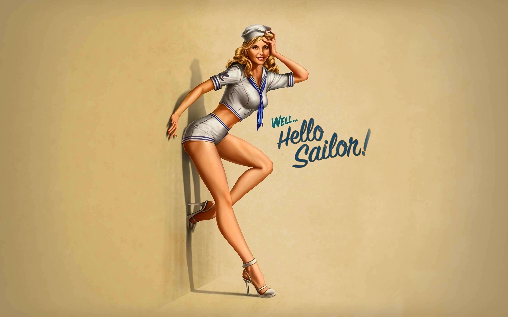
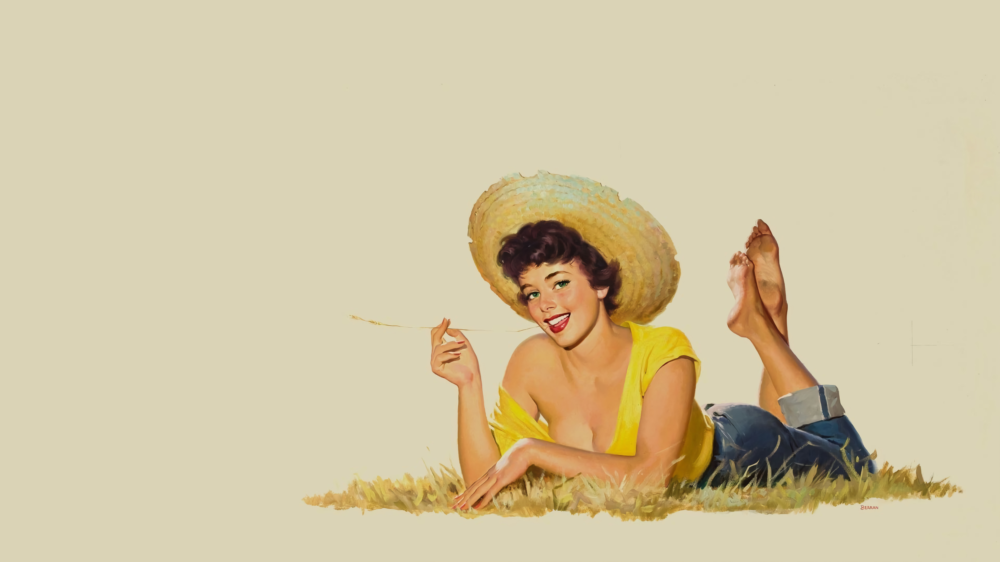
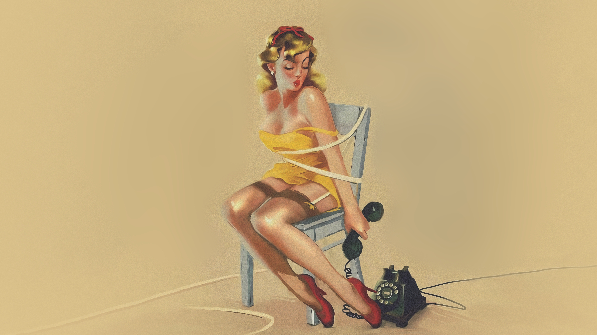
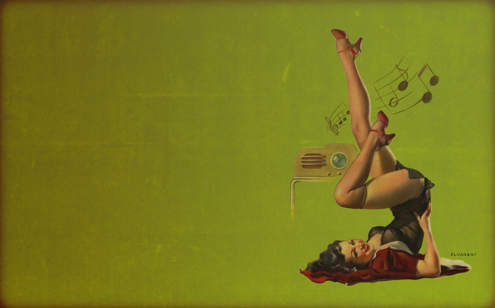

# Omarchy Pinup Theme

A light vintage pin-up theme for Omarchy, built around warm paper, dark ink, sailor blue focus states, burgundy accents, and soft rounded surfaces. It keeps the desktop bright and readable while giving the shell, terminals, editor themes, and notification surfaces the same printed-poster character.

## Preview


## Install

Use the Omarchy theme installer:

```bash
omarchy-theme-install https://github.com/OldJobobo/omarchy-pinup-theme
```

## What's Included

- A light Omarchy palette with cream backgrounds, dark ink text, blue selection states, and warm vintage support colors.
- Theme-scoped Hyprland styling with rounded windows, soft depth, active border gradients, and tuned animation curves.
- Omarchy shell tokens in `shell.toml` for bar, popups, launcher, menus, notifications, lock, and image picker surfaces.
- Matching Waybar, Walker, Mako, SwayOSD, Hyprlock, GTK, Chromium, and Vencord styling.
- Synced terminal colors for Foot, Alacritty, Kitty, Ghostty, and Warp, plus btop and Zellij themes.
- Editor support for Neovim, Zed, and the bundled VS Code color theme extension.
- Twelve high-resolution pin-up wallpapers in `backgrounds/`.

## Wallpapers

<table>
  <tr>
    <td></td>
    <td></td>
    <td></td>
  </tr>
  <tr>
    <td></td>
    <td></td>
    <td></td>
  </tr>
  <tr>
    <td></td>
    <td></td>
    <td></td>
  </tr>
  <tr>
    <td></td>
    <td></td>
    <td></td>
  </tr>
</table>

## Notes

- `light.mode` is included, so Omarchy should treat this as a light theme.
- The theme uses `Yaru-blue` from `icons.theme`.

